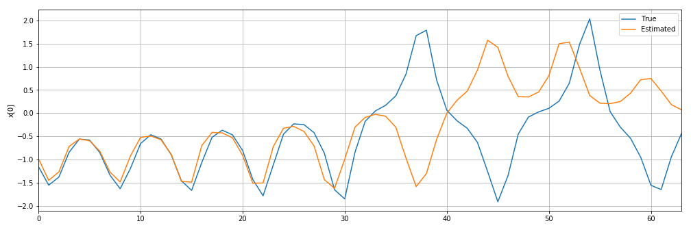

# Prediction of the sequence from Lorenz attractor by GRU

This project provides an example of failure of GRU's prediction.
The Lorenz equation is a well-known for producing a chaotic oscillation.
Here, a GRU model is applied to model the sequence from Lorenz attractor.
The result is like this:

The blue and orange line denotes a sequence from Lorenz attractor and one estimated by the learned GRU, respectively.
You can see that the early part of the sequence can be traced well by the model, however, the latter part can not.

